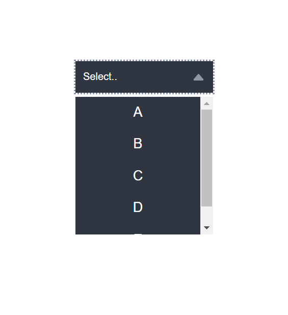

# Custom Select

A custom select dropdown using HTML, CSS and JavaScript

## Demo

[GitHub Pages](https://dev-caspertheghost.github.io/css-custom-select)

[Example with form](https://dev-caspertheghost.github.io/css-custom-select/example/example.html)

### Screenshot:

## What I learned 

- CSS positions
- Javascript `classList`